# Jarvis 2.0 — Scheduled Jobs Framework

**Status:** design
**Date:** 2026-05-06
**Author:** Meet (with Claude)
**Supersedes:** the path-filtered `bot/**` notifications in `.github/workflows/jarvis-discord.yml`

## Goal

Make `#jarvis` and the Jarvis bot useful instead of duplicating `#ci-alerts`.

Today the `#jarvis` Discord channel is fed by a GitHub Actions workflow that mirrors PR open / merge / close / push events scoped to `bot/**`. That signal already exists in `#ci-alerts`, so `#jarvis` is mostly noise. Meanwhile the Jarvis bot itself (in `bot/`) is purely reactive — it answers @-mentions but never proactively posts anything.

This spec adds a generalized **scheduled jobs framework** to the bot so it can:

- Run cron-scheduled tasks that compose synthesized or templated posts.
- **Route each post to the right existing channel** (e.g. PR nudges → `#code-review`, sprint brief → `#weekly-sync`) instead of dumping everything into `#jarvis`.
- Repurpose `#jarvis` itself as a **bot-meta channel** for boot pings, per-job audit (`✅ ran X → posted to #Y`), and failures.
- Replace the current `jarvis-discord.yml` GHA workflow.

The framework lands generalized (not seven hardcoded jobs in `main.py`) so we can add behaviors over time without re-architecting.

## Architecture



Source: [`docs/diagrams/jarvis-scheduled-jobs.mmd`](../../diagrams/jarvis-scheduled-jobs.mmd)

### Key decisions

- **Single process, shared event loop.** `apscheduler.schedulers.asyncio.AsyncIOScheduler` runs alongside the existing Discord gateway in `jarvis.main.run()`. No new deployable, no leader election, no cross-process IPC.
- **Kinds reuse the existing `AsyncGitHubClient` and tool helpers, but not via the agent loop.** Kind handlers call data-fetching functions directly. Only digest kinds make a (toolless) Anthropic call to polish prose — the LLM never gets tools in this path so cost and surprise are bounded.
- **Firestore is the only state store.** Same client the bot already initializes for `ThreadMemory`. Two collections: `job_state/{name}` for last-run timestamp + status; `job_dedup/{job}/{key}` for per-key dedup with read-time `expires_at` check.
- **Channel routing is config-only.** Each manifest entry names its target channel; the executor resolves channel ID via a static alias map and `client.get_channel()`.
- **Self-report is middleware, not a job.** A wrapper around the executor emits one Discord message to `#jarvis` per job run with status + target.

### Repo layout (new files)

```
bot/jarvis/
├── jobs/
│   ├── __init__.py            # Job dataclass, KindContext / KindResult / PlannedPost
│   ├── manifest.py            # JOBS = [Job(...), ...]
│   ├── executor.py            # JobExecutor.run(job)
│   ├── scheduler.py           # build_scheduler(executor, jobs)
│   ├── channels.py            # CHANNEL_IDS + resolve()
│   ├── team.py                # GitHub login → Discord ID + mention()
│   ├── state.py               # FirestoreJobState — last_run, dedup get/set
│   ├── self_report.py         # SelfReporter (boot, job_ok, job_error)
│   ├── run.py                 # CLI: python -m jarvis.jobs.run <name>
│   └── kinds/
│       ├── __init__.py        # KIND_REGISTRY
│       ├── digest_via_agent.py
│       ├── pr_review_nudge.py
│       ├── approved_pr_not_merged.py
│       ├── ci_red_pr_nudge.py
│       ├── dependabot_pair_check.py
│       └── stuck_in_progress.py
└── tests/
    ├── test_jobs_executor.py
    ├── test_jobs_scheduler.py
    ├── test_jobs_state.py
    ├── test_jobs_manifest.py
    ├── test_jobs_self_report.py
    └── test_jobs_kind_<each>.py
```

`main.py` gets ~15 new lines: build the executor + scheduler, start it after `bot.wait_until_ready()`, cancel on shutdown.

## Manifest schema

The manifest is **Python**, not YAML — typed, importable, easier to test.

```python
# bot/jarvis/jobs/__init__.py
from dataclasses import dataclass, field
from typing import Any, Optional, Callable, Awaitable

@dataclass(frozen=True)
class Job:
    name: str                                    # e.g. "pr_review_nudge"
    kind: str                                    # looked up in KIND_REGISTRY
    cron: str                                    # crontab syntax
    channel: str                                 # alias resolved via channels.py
    timezone: str = "America/Toronto"
    params: dict[str, Any] = field(default_factory=dict)
    enabled: bool = True

@dataclass
class PlannedPost:
    content: str                                 # message body; executor splits if > 2000 chars
    dedup_key: Optional[str] = None              # if set, executor checks job_dedup/{job}/{key}

@dataclass
class KindResult:
    posts: list[PlannedPost]
    state_writes: dict[str, Any] = field(default_factory=dict)
    summary: str = ""                            # one-line for #jarvis self-report

@dataclass
class KindContext:
    job: Job
    discord_channel: Any                         # discord.TextChannel
    github_client: Any                           # AsyncGitHubClient
    anthropic_client: Any                        # AsyncAnthropic
    state: "JobState"
    now: datetime
    settings: Settings
    logger: logging.Logger

KindHandler = Callable[[KindContext], Awaitable[KindResult]]
```

### v1 manifest

```python
# bot/jarvis/jobs/manifest.py
JOBS: list[Job] = [
    Job(
        name="morning_sprint_brief",
        kind="digest_via_agent",
        cron="0 9 * * 1-5",
        channel="#weekly-sync",
        params={
            "sources": ["sprint", "recent_commits", "open_prs"],
            "lookback_hours": 24,
            "polish_prompt": "morning_sprint_brief",
        },
    ),
    Job(
        name="pr_review_nudge",
        kind="pr_review_nudge",
        cron="0 10-18/4 * * 1-5",
        channel="#code-review",
        params={"min_age_hours": 4, "dedup_window": "1d"},
    ),
    Job(
        name="approved_pr_not_merged",
        kind="approved_pr_not_merged",
        cron="0 10-18/3 * * 1-5",
        channel="#code-review",
        params={"min_age_after_approval_hours": 2, "dedup_window": "12h"},
    ),
    Job(
        name="ci_red_pr_nudge",
        kind="ci_red_pr_nudge",
        cron="0 10-18/2 * * 1-5",
        channel="#code-review",
        params={"dedup_window": "6h"},
    ),
    Job(
        name="dependabot_pair_check",
        kind="dependabot_pair_check",
        cron="30 9 * * 1-5",
        channel="#code-review",
        params={"pairs": [
            ["react", "react-dom"],
            ["@types/react", "@types/react-dom"],
            ["eslint", "@typescript-eslint/parser", "@typescript-eslint/eslint-plugin"],
        ]},
    ),
    Job(
        name="stuck_in_progress",
        kind="stuck_in_progress",
        cron="0 11 * * 1-5",
        channel="#blockers",
        params={"stale_days": 3, "dedup_window": "1d"},
    ),
    Job(
        name="end_of_week_recap",
        kind="digest_via_agent",
        cron="0 16 * * 5",
        channel="#milestones-updates",
        params={
            "sources": ["sprint", "recent_commits", "merged_prs"],
            "lookback_hours": 168,
            "polish_prompt": "end_of_week_recap",
        },
    ),
]
```

### Why this shape

- **`name` is the Firestore key.** One doc per job: `job_state/{name}`. Renaming a job loses its history — that's a feature, forces explicit thought about whether dedup state should carry over.
- **`kind` ≠ `name`.** Two jobs share `kind="digest_via_agent"` (morning brief + Friday recap) — different schedules and prompts, same code path.
- **`params` is `dict[str, Any]`.** Each kind validates what it needs at call time. We can tighten with per-kind `TypedDict` later if it gets noisy.
- **`enabled: bool`** lets us land a job's code without scheduling it — useful while iterating on prompts in dev.
- **`cron` strings only**, no APScheduler `IntervalTrigger`/`DateTrigger` aliases. One way to express schedules.

### Boot-time validation

Before APScheduler starts, `validate_manifest()` enforces:

1. Every `kind` resolves in `KIND_REGISTRY`.
2. Every `channel` resolves in `CHANNEL_IDS`.
3. Every `cron` parses (`CronTrigger.from_crontab` raises on invalid).
4. `name` values are unique.

Failed validation → bot boots with scheduler **disabled** and a loud error in `#jarvis`. The gateway still works; @-mention chat keeps functioning.

## Job-kind registry

Each kind is one Python module under `bot/jarvis/jobs/kinds/`. Kinds **return data, the executor sends posts.** Kinds never touch Discord directly — that makes them trivially unit-testable (no `discord.py` mocks needed).

### `digest_via_agent` — used by `morning_sprint_brief`, `end_of_week_recap`

1. Pull data from `params["sources"]` (sprint, recent_commits, open/merged PRs) using existing helpers.
2. Format as a structured "data brief" deterministically (bullets/tables in plain Python).
3. Send to Anthropic with a constrained prompt:
   - `system`: "You polish standup briefs. NEVER invent facts. NEVER call tools."
   - `user`: "<data brief>\n\nWrite a short Discord-friendly summary."
   - `tools=[]` ← critical
   - `max_tokens: 600`
4. Return `[PlannedPost(content=polished_text)]`.

If Anthropic 5xx, fall back to the deterministic data brief text — still useful, no LLM needed.

### `pr_review_nudge` → `#code-review`

1. List open PRs in `tsuki-works/niko`.
2. Filter: not draft, ready_for_review, age > `min_age_hours`, has assigned reviewers (or fall back to no-tag if none).
3. `dedup_key = f"PR-{n}_{date.today().isoformat()}"`
4. Skip PRs whose key already exists in `job_dedup`.
5. Compose: `"👀 PR #N waiting on review (Xh) — <@reviewer> {title} {url}"`.

### `approved_pr_not_merged` → `#code-review`

1. List open PRs.
2. Filter: ≥1 approving review, all required checks passing, `approved_at + min_age_after_approval_hours < now`.
3. `dedup_key = f"PR-{n}_approved_{approved_at.date()}"`
4. Compose: `"✅ PR #N approved Xh ago and green — <@author>, ready to merge?"`

### `ci_red_pr_nudge` → `#code-review`

1. List open PRs.
2. Fetch latest check-runs / commit status for each.
3. Filter: ≥1 required check failing.
4. `dedup_key = f"PR-{n}_red_{head_sha}_{failing_check}"` (deduped on SHA, so a new push retriggers).
5. Compose: `"❌ PR #N — {check_name} failed. <@author> {check_url}"`

### `dependabot_pair_check` → `#code-review`

1. List open PRs by author `dependabot[bot]`.
2. Parse each title (`"Bumps X from a to b"`) to extract package name.
3. For each pair group in `params["pairs"]`, find packages with an open PR.
4. If ≥2 of a pair are open simultaneously:
   - `dedup_key = "pair_" + "_".join(sorted(present)) + "_" + date.today().iso`
   - Compose: `"📦 Paired Dependabot PRs — merge together or master may break:\n - PR #x bumps react\n - PR #y bumps react-dom"`

Direct hit on the paired-package hazard already burned us once.

### `stuck_in_progress` → `#blockers`

1. Hit GitHub Project v2 GraphQL for `tsuki-works/niko` project #2.
2. Filter items where Status == "In progress".
3. For each, find the latest commit on any branch referencing the issue. Stale if no commit OR last commit > `stale_days` ago.
4. `dedup_key = f"item-{node_id}_{date.today().isoformat()}"`
5. Compose: `"⏳ <@assignee> Issue #N has been 'In progress' for Xd with no recent commits — anything blocking?"`

This kind is the most expensive (Project v2 GraphQL + branch search). If multiple kinds in the same fire window need the same data, the executor caches per-cycle — but in practice the cron schedules don't overlap significantly, so v1 just refetches.

### Failure semantics for kinds

Per kind, all upstream failures (GitHub 4xx/5xx, Anthropic 5xx, Firestore unavailable) → kind returns `KindResult(posts=[], summary="github error: 503")`. No posts go out, no state writes (except `last_status`). Executor self-reports `❌` to `#jarvis`.

## Scheduler, executor, dedup state

### Scheduler

```python
# bot/jarvis/jobs/scheduler.py
def build_scheduler(executor, jobs: list[Job]) -> AsyncIOScheduler:
    sched = AsyncIOScheduler(timezone="UTC")
    for job in jobs:
        if not job.enabled:
            continue
        trigger = CronTrigger.from_crontab(job.cron, timezone=job.timezone)
        sched.add_job(
            executor.run, trigger,
            args=[job],
            id=job.name,
            misfire_grace_time=300,    # ≤5 min late, still run
            coalesce=True,              # collapse queued fires during downtime
            max_instances=1,            # never overlap a job with itself
        )
    return sched
```

Started from `main.run()` after the gateway is ready:

```python
async def start_scheduler_after_ready():
    await bot.wait_until_ready()
    validate_manifest(JOBS, KIND_REGISTRY, CHANNEL_IDS)
    scheduler.start()
```

On shutdown: `scheduler.shutdown(wait=False)` in the existing `finally` block.

### Executor

```python
class JobExecutor:
    async def run(self, job: Job) -> None:
        log = logging.getLogger(f"jarvis.jobs.{job.name}")
        started = self._now()
        try:
            channel = await self._resolve_channel(job.channel)
            state = self._state_for(job)
            ctx = KindContext(job=job, discord_channel=channel, ..., state=state, now=started)

            kind_fn = KIND_REGISTRY[job.kind]
            result = await kind_fn(ctx)

            posted = 0
            for post in result.posts:
                if post.dedup_key and await state.is_dedup_seen(post.dedup_key):
                    continue
                await self._send_with_split(channel, post.content)
                if post.dedup_key:
                    await state.mark_dedup_seen(post.dedup_key, ttl=self._dedup_ttl(job))
                posted += 1

            await state.merge_state({**result.state_writes, "last_run_at": started, "last_status": "ok"})
            await self._self_report.job_ok(job, summary=f"{posted} post(s) → {job.channel}: {result.summary}")
        except Exception as e:
            log.exception("job failed")
            await self._state_for(job).merge_state({"last_run_at": started, "last_status": f"error: {type(e).__name__}"})
            await self._self_report.job_error(job, e)
            # do NOT re-raise — APScheduler logs would just duplicate; we own the report path
```

### Firestore state model

```
job_state/{job_name}                              # one doc per job
  last_run_at:    timestamp
  last_status:    "ok" | "error: <class>"
  <kind-specific keys merged from KindResult.state_writes>

job_dedup/{job_name}/keys/{dedup_key}             # one doc per dedup hit
  seen_at:    timestamp
  expires_at: timestamp                           # set by executor based on dedup_window
```

`is_dedup_seen` reads the doc and checks `expires_at > now`. Read-time check (rather than relying on Firestore native TTL) keeps the contract explicit and dev-environment-friendly. A daily sweep (running as part of `bot_self_report` boot path) deletes `job_dedup/*/keys` where `expires_at < now`.

### Failure / misfire matrix

| Scenario | Behavior |
|---|---|
| VM down during fire window | `misfire_grace_time=300`: runs on boot if ≤5 min late, else skipped |
| Multiple fires queued during downtime | `coalesce=True`: runs once |
| Job already running at next tick | `max_instances=1`: skipped (logged) |
| GitHub 5xx mid-job | KindResult error → no posts, `last_status` updated, `❌` in `#jarvis` |
| Discord post fails after kind succeeded | per-post try/except; failed post logged but state advances for *posted* items (partial success is correct) |
| Bot restart mid-job | Job re-runs on next cron tick; dedup keys protect against re-posting |

### v1 deliberately skips

- **Persistent APScheduler jobstore** — in-memory only; manifest is the source of truth at every boot.
- **Leader election / multi-VM safety** — single VM.
- **Retry on Discord 5xx** — `discord.py` already retries internally.

### Manual trigger CLI

```bash
PYTHONPATH=bot .venv/Scripts/python -m jarvis.jobs.run pr_review_nudge
```

`bot/jarvis/jobs/run.py` builds the same dependency graph as `main.py`, resolves the named job from `JOBS`, calls `executor.run(job)` once, exits. Same code path as cron — what you debug locally is what fires on schedule.

## Channel routing and `bot_self_report`

### Channel registry

```python
# bot/jarvis/jobs/channels.py
CHANNEL_IDS: dict[str, int] = {
    "#jarvis":             1500002427389087787,
    "#code-review":        1495194166886400021,
    "#ci-alerts":          1495194041246285857,
    "#blockers":           1495192657545396354,
    "#weekly-sync":        1499827602397859961,
    "#milestones-updates": 1495607520444551278,
    "#decisions-log":      1495192153947766885,
    "#general":            1495192027913130074,
    "#infra":              1495193915362508911,
    "#backend":            1495193663628640256,
    "#frontend":           1495193789592113156,
    "#demos":              1499827733302349844,
}
```

Static dict, not Discord lookup-by-name: names can change, IDs are stable, `client.get_channel(id)` is sync and cache-hit cheap. Boot-time `validate_manifest()` resolves every job's channel — typo crashes the bot at startup, not at 9am.

### Mentions

```python
# bot/jarvis/jobs/team.py
GH_LOGIN_TO_DISCORD: dict[str, int] = {
    "MeetDigrajkar":  295016116881850370,
    # other teammates filled in at implementation time from reference_team_ids memory
}

def mention(login: str | None) -> str:
    if not login:
        return "_(unassigned)_"
    uid = GH_LOGIN_TO_DISCORD.get(login)
    return f"<@{uid}>" if uid else f"`{login}`"
```

### `SelfReporter` — middleware, not a job

| Event | Source | Format |
|---|---|---|
| Boot | `JarvisBot.on_ready` | `🟢 Jarvis online · commit \`<short-sha>\` · scheduler: <N> jobs` |
| Job ok | `JobExecutor` end-of-run | `✅ \`<job_name>\` → #target · <summary>` |
| Job error | `JobExecutor` exception path | `❌ \`<job_name>\` failed · <error_class>: <msg>` (truncated to 500 chars) |

`_post()` swallows failures so a transient Discord error during self-report can't take down a real job.

### Replacing `jarvis-discord.yml`

The current GHA workflow posts PR-opened/merged/closed/push events scoped to `bot/**` to `#jarvis`. With `SelfReporter.boot()` covering deploys (the VM restarts on every git pull, so the boot ping confirms the deploy *and* shows the new SHA) and `pr_review_nudge` covering "PRs need attention" repo-wide, the workflow has nothing left to do.

**Action: delete `.github/workflows/jarvis-discord.yml` as part of the implementation PR.** The GHA path doesn't know whether the VM picked up the change; the boot ping does.

## Testing approach

Per kind, in `bot/tests/test_jobs_*.py`:

- **Unit (every kind):** mock `KindContext` (in-memory `JobState`, fake `AsyncGitHubClient` returning fixture JSON). Assert returned `KindResult` — no Discord, no Anthropic.
- **Integration (one per kind):** real kind code + fixture GitHub responses + (for digest kinds) mocked Anthropic. Assert posts + state writes.
- **Executor:** test misfire / dedup / error-paths against a fake kind.
- **Manifest:** assert every entry validates against the kind registry + channel registry.
- **Scheduler:** assert APScheduler is configured with the expected job IDs and triggers.
- **SelfReporter:** assert each event posts to `#jarvis`; assert errors are swallowed.

No `live_discord` tests for v1. The `bot/jarvis/jobs/run.py` CLI is the manual smoke test.

## Implementation phasing (for the planning step)

Some kinds need GitHub-client methods that may not yet exist on `AsyncGitHubClient` — review state, check-runs / commit status, GitHub Projects v2 GraphQL items, PRs filtered by author. PR 1 of the implementation should audit `bot/jarvis/github_client.py`, list the gaps, and decide whether to extend the existing client or add a thin sibling (`bot/jarvis/jobs/github_queries.py`) for jobs-only reads.

Suggested PR breakdown for the writing-plans skill:

1. **PR 1 — framework skeleton + GitHub-client gap audit.** `Job` dataclass, manifest, `KindRegistry`, `JobExecutor`, `build_scheduler`, `validate_manifest`, channel + team modules, `SelfReporter`, Firestore `JobState`, manual-trigger CLI, manifest tests, executor tests. **No kinds shipped yet.** Manifest is empty or uses a no-op test kind. Includes the GitHub-client gap audit + any helpers shared by ≥2 kinds.
2. **PR 2 — `pr_review_nudge` + `approved_pr_not_merged` + `ci_red_pr_nudge`.** First three pure-deterministic kinds; share PR-list fetch helper.
3. **PR 3 — `dependabot_pair_check` + `stuck_in_progress`.** Two more deterministic kinds.
4. **PR 4 — `digest_via_agent` + the two digest jobs.** Adds the constrained Anthropic call, polish prompts.
5. **PR 5 — wire into `main.run()`, delete `jarvis-discord.yml`, deploy.** Update CLAUDE.md (channel IDs, drop `#okrs-roadmap`).

Each PR is independently reviewable and reversible. Manifest entries are added job-by-job so we can disable any one if it over-pings.

## Out of scope (deferred)

- **Reactive jobs** that respond to Discord messages (`decisions_log_followup`, doc-drift on commit) — different mechanism (event listener + delayed task), not cron. v1.5 follow-up.
- **Per-job typed params** (`TypedDict` per kind) — only worth it if `params` gets ambiguous in practice.
- **Persistent APScheduler jobstore** — needed only when we have multi-VM or want recovery semantics richer than the 5-min misfire window.
- **Cost/voice-call alerts** — no Phase-1 deployment yet to monitor.
- **GHA → SSH auto-deploy.** Mentioned in `infra/jarvis/README.md` as a follow-up; orthogonal to this spec.

## Risks and mitigations

| Risk | Mitigation |
|---|---|
| Over-pinging a 4-person team | Conservative cadences in v1; per-job `enabled: bool` flag for quick kill switch; manifest changes go through PR review |
| Anthropic cost on digest jobs | Constrained `tools=[]` calls, `max_tokens: 600`, ~7 calls/week total |
| GitHub rate limits | Using existing `AsyncGitHubClient` (already paginated and authed); kinds within a fire window can share PR-snapshot cache if needed |
| LLM hallucinating PR numbers in digests | Digest prompt forbids invention; system prompt explicit; data brief is the floor (used as fallback on Anthropic failure) |
| Bot crashes mid-job | APScheduler `misfire_grace_time=300` recovers ≤5 min outages; longer outages skip; dedup keys prevent double-posting |
| Discord channel renamed / deleted | Boot-time `validate_manifest` fails fast in `#jarvis`; gateway keeps working |

## Open questions

- **Time zone default.** Picked `America/Toronto`. Per-job override possible; revisit if Sandeep/Kailash are in a different TZ and complain.
- **"Required check" definition for `ci_red_pr_nudge`.** v1: any failing check on the latest SHA. Tighten to branch-protection-required-only if noisy.
- **Friday recap vs Monday digest.** Picked Friday recap; can add Monday "what's queued" if Friday alone is too retrospective.
